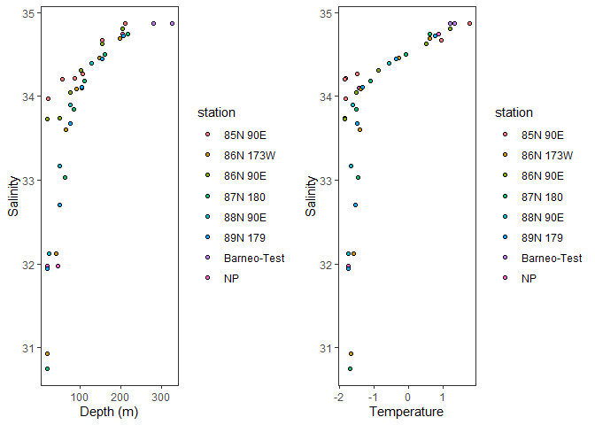

# Introduction

Load data


```r
d<-read_csv("~/NCEAS training/NPEO2010BottleData.csv")
```

How does salinity vary among stations? Which station is the saltiest and which has the most variable salinity?

# Analysis

Where are these stations?


```r
dstations<-d%>%
  select(station, lat, lon)%>%
  distinct()
leaflet(dstations)%>%
  addTiles()%>%
  addCircles(lng=~lon, lat = ~lat)
```

<!--html_preserve--><div id="htmlwidget-6fb2346c7dfe80f88e05" style="width:672px;height:480px;" class="leaflet html-widget"></div>
<script type="application/json" data-for="htmlwidget-6fb2346c7dfe80f88e05">{"x":{"options":{"crs":{"crsClass":"L.CRS.EPSG3857","code":null,"proj4def":null,"projectedBounds":null,"options":{}}},"calls":[{"method":"addTiles","args":["//{s}.tile.openstreetmap.org/{z}/{x}/{y}.png",null,null,{"minZoom":0,"maxZoom":18,"tileSize":256,"subdomains":"abc","errorTileUrl":"","tms":false,"noWrap":false,"zoomOffset":0,"zoomReverse":false,"opacity":1,"zIndex":1,"detectRetina":false,"attribution":"&copy; <a href=\"http://openstreetmap.org\">OpenStreetMap<\/a> contributors, <a href=\"http://creativecommons.org/licenses/by-sa/2.0/\">CC-BY-SA<\/a>"}]},{"method":"addCircles","args":[[89.05705,84.9916666666667,85.985,89.9916666666667,87.9563333333333,86.97,86.0038333333333,89.0183333333333],[70.93795,89.9853333333333,89.5733333333333,7.06666666666667,89.2568333333333,179.837833333333,173.286666666667,178.665],10,null,null,{"interactive":true,"className":"","stroke":true,"color":"#03F","weight":5,"opacity":0.5,"fill":true,"fillColor":"#03F","fillOpacity":0.2},null,null,null,{"interactive":false,"permanent":false,"direction":"auto","opacity":1,"offset":[0,0],"textsize":"10px","textOnly":false,"className":"","sticky":true},null,null]}],"limits":{"lat":[84.9916666666667,89.9916666666667],"lng":[7.06666666666667,179.837833333333]}},"evals":[],"jsHooks":[]}</script><!--/html_preserve-->

Plot salinity vs depth curves for selected stations.

<!-- -->

Summarise salinity for each station

```r
dsal<-d%>%
  group_by(station)%>%
  summarise(Salinity=mean(salinity_A, na.rm=T), Salinity_sd=sd(salinity_A, na.rm=T))

dsal
```

```
## # A tibble: 8 x 3
##   station     Salinity Salinity_sd
##   <chr>          <dbl>       <dbl>
## 1 85N 90E         34.4    0.331   
## 2 86N 173W        33.3    1.48    
## 3 86N 90E         34.2    0.453   
## 4 87N 180         33.5    1.48    
## 5 88N 90E         33.0    1.01    
## 6 89N 179         33.6    1.08    
## 7 Barneo-Test     34.9    0.000212
## 8 NP              33.2    1.44
```

# Results

Salinity ranges from 30.7571 to 34.867. Barneo-Test is the saltiest station and 88N 90E is the freshest station. 86N 173W has the most variable salinity and Barneo-Test has the least variable salinity. 
